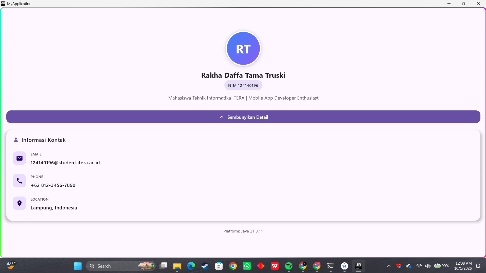

# Repository Tugas Praktikum Pengembangan Aplikasi Mobile

- **Nama**: Rakha Daffa Tama Truski
- **NIM**: 124140196

---

## 📌 Praktikum 1: Pengenalan MK & Setup Environment
- **Deskripsi**: Setup Compose Multiplatform dan modifikasi "Hello World".
- **Status**: Completed
- **Tampilan**:
  

---

## 📌 Praktikum 3: My Profile App (Compose UI)
- **Deskripsi**: Tampilan profil diri menggunakan reusable composables, layouting, dan animasi `AnimatedVisibility`.
- **Fitur**: `ProfileHeader`, `InfoItem`, `ProfileCard`, dan Toggle Button.
- **Status**: Completed
- **Tampilan**:
  